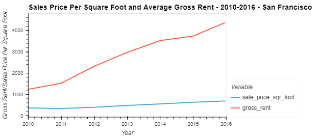
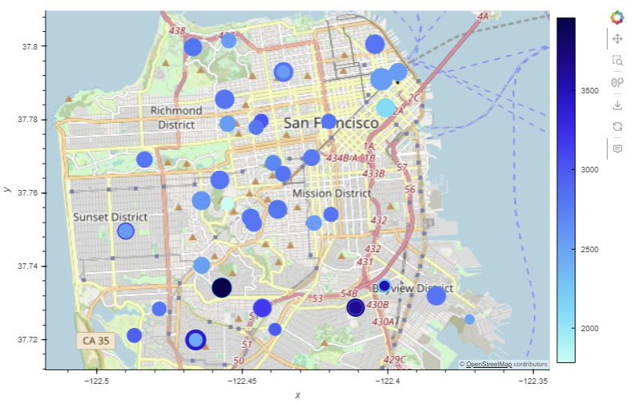

# San-Francisco-Housing
---
This project aims to identify viable investment properties in the San Francisco real estate market for a proptech company offering an instant buy-and-rent service. Using data visualization techniques such as aggregation, interactive visualizations, and geospatial analysis, the project will determine promising properties for the trial phase, with the potential for market expansion based on its success.


## Technologies

1. Aggregation
   1. Groupby()
   2. 

2. Hvplot
   1. Geoviews
   2. 
     
3. Pandas Dataframe
   1. concat()
   2. 
     

---

## Installation Guide

```python
# To run this analysis, you need serveral libraries from Python, such as Pandas and hvplot
import pandas as pd
import hvplot.pandas
from pathlib import Path
```

---
## Usage

#### Description
This project aims to support a proptech company's launch of an instant buy-and-rent service in the San Francisco real estate market. By leveraging advanced data visualization techniques, including aggregation, interactive visualizations, and geospatial analysis, the project seeks to identify lucrative investment properties. The success of this trial phase will determine the feasibility of expanding the service to other markets.
  
#### Processing
**Sales Price Per Square Foot and Average Gross Rent - 2010-2016 - San Francisco**   
   
**Geoviews Plot**   
   
**Housing Units in San Francisco - 2010 to 2016**   
   
**Sales Price Per Square Foot and Average Gross Rent - 2010-2016 - San Francisco**   
   

---

## Contributors

Shu Liu   
shu@liu.net

---

## License

MIT License

Copyright (c) 2024 Shu

Permission is hereby granted, free of charge, to any person obtaining a copy
of this software and associated documentation files (the "Software"), to deal
in the Software without restriction, including without limitation the rights
to use, copy, modify, merge, publish, distribute, sublicense, and/or sell
copies of the Software, and to permit persons to whom the Software is
furnished to do so, subject to the following conditions:

The above copyright notice and this permission notice shall be included in all
copies or substantial portions of the Software.

THE SOFTWARE IS PROVIDED "AS IS", WITHOUT WARRANTY OF ANY KIND, EXPRESS OR
IMPLIED, INCLUDING BUT NOT LIMITED TO THE WARRANTIES OF MERCHANTABILITY,
FITNESS FOR A PARTICULAR PURPOSE AND NONINFRINGEMENT. IN NO EVENT SHALL THE
AUTHORS OR COPYRIGHT HOLDERS BE LIABLE FOR ANY CLAIM, DAMAGES OR OTHER
LIABILITY, WHETHER IN AN ACTION OF CONTRACT, TORT OR OTHERWISE, ARISING FROM,
OUT OF OR IN CONNECTION WITH THE SOFTWARE OR THE USE OR OTHER DEALINGS IN THE
SOFTWARE.